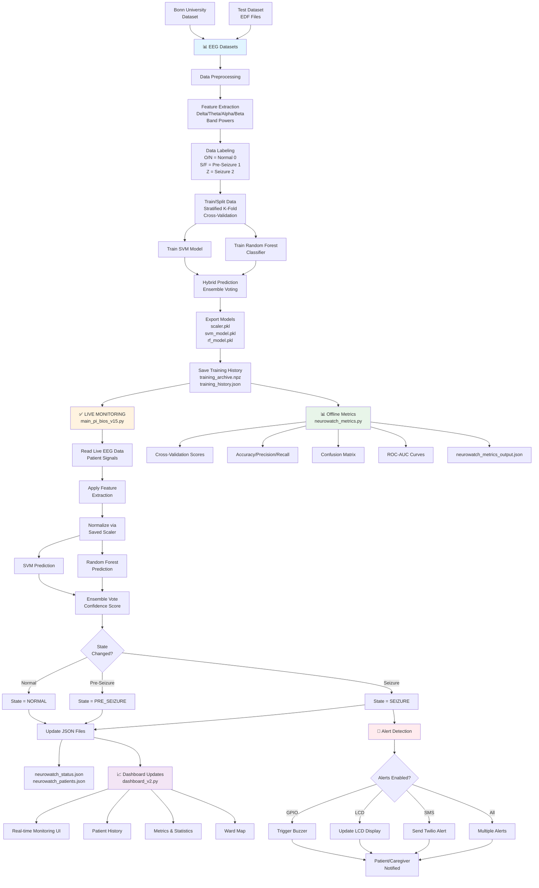
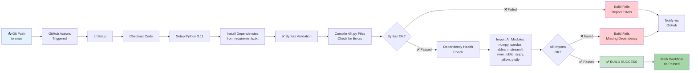
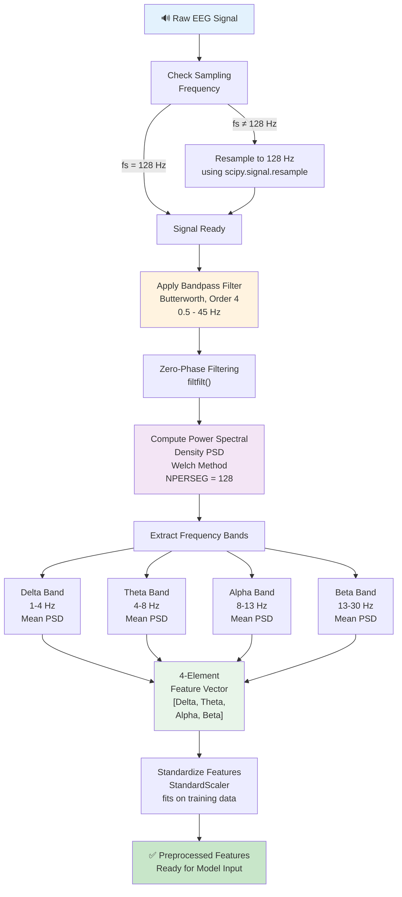

# NeuroWatch Project

> This README is auto-generated by `generate_readme.py`.
> Last generated: 2026-04-16 20:30:33

NeuroWatch is an EEG seizure detection and monitoring project that combines machine learning, a Raspberry Pi runtime, patient-state tracking, JSON feeds for a dashboard, and optional SMS alerts.

## Project Structure

- `src/` — application code (monitor engine, dashboards, patient registry, notifier, metrics pipeline)
- `scripts/` — utility scripts (training, prediction helper, dataset scanner, README generator)
- `models/` — trained artifacts and training history
- Root `.py` files — compatibility launchers so existing commands still work

## How to Run

1. Install dependencies:

```bash
pip install -r requirements.txt
```

2. (Optional) Configure Twilio SMS placeholders in `.env`.

3. Start the core workflows:

```bash
python train_and_export.py --data "data/Bonn Univeristy Dataset"
python main_pi_bios_v15.py
streamlit run dashboard_v2.py
```

## What This Project Does

- Detects EEG states as `Normal`, `Pre-Seizure`, or `Seizure`
- Uses a hybrid `SVM + Random Forest` model
- Monitors one live patient and can simulate demo patients for the dashboard
- Writes JSON outputs for real-time UI updates
- Supports optional Raspberry Pi GPIO, LCD, buzzer, and Twilio SMS alerts

## System Architecture & Complete Process Flow



## Workflow (CI/CD Pipeline)



### Workflow Stages Explained:
- **Push Trigger** — Workflow runs on every push to `main` branch or pull request
- **Syntax Check** — Verifies all Python files compile without errors
- **Dependency Check** — Ensures all required packages can be imported
- **Success/Failure** — GitHub displays status badge in your repository

---

## Data Preprocessing & Feature Extraction Pipeline



### Feature Extraction Details:
- **Band Power Calculation** — Average power in each frequency band computed from PSD
- **4 EEG Bands**:
  - **Delta (1-4 Hz)** — Associated with deep sleep and seizure activity
  - **Theta (4-8 Hz)** — Associated with drowsiness
  - **Alpha (8-13 Hz)** — Associated with relaxation
  - **Beta (13-30 Hz)** — Associated with alert, active thinking
- **Standardization** — Each feature is normalized using training data mean/std to ensure consistent model input
- **Output** — Preprocessed feature vectors fed to SVM + Random Forest classifiers

---

## Main Files

- `dashboard_v2.py`: Streamlit dashboard for multi-patient monitoring, metrics, and history views.
- `generate_readme.py`: Project utility script.
- `main_pi_bios_v15.py`: Main live monitoring engine for EEG detection, patient state updates, and hardware alerts.
- `neurowatch_metrics.py`: Offline metrics pipeline for the prepared test dataset.
- `patient_watch_ui_clean.py`: Project utility script.
- `patients.py`: Patient registry with live and demo patient definitions.
- `run_prediction.py`: Local prediction and visualization utility for stepping through EEG files.
- `scan_edf_dataset.py`: Dataset scanning helper for EDF-based EEG files.
- `sms_notifier.py`: Twilio-based SMS notification helper with cooldown handling.
- `train_and_export.py`: Training and incremental retraining pipeline that exports the scaler and models.

## Data Layout

- `data/Bonn Univeristy Dataset/`
- `data/Test dataset/`

## Models

- Export path: `models/`
- Main artifacts: `scaler.pkl`, `svm_model.pkl`, `rf_model.pkl`
- Incremental training artifacts: `training_archive.npz`, `training_history.json`

## Dependencies

Core packages detected from the Python scripts:

- `joblib`
- `mne`
- `numpy`
- `pandas`
- `plotly`
- `scipy`
- `sklearn`
- `streamlit`

Optional integrations detected:

- `PIL`
- `RPLCD`
- `RPi`

Suggested install command:

```bash
pip install joblib matplotlib mne numpy pandas plotly pyedflib scikit-learn scipy streamlit twilio
```

## Common Commands

Train or refresh the models:

```bash
python train_and_export.py --data "data/Bonn Univeristy Dataset"
```

Run the monitoring engine:

```bash
python main_pi_bios_v15.py
```

Run the dashboard:

```bash
streamlit run dashboard_v2.py
```

Compute offline metrics:

```bash
python neurowatch_metrics.py
```

Regenerate this README manually:

```bash
python generate_readme.py
```

Start automatic README updates in PowerShell:

```powershell
.\watch_readme.ps1
```

## Runtime Outputs

- `neurowatch_status.json`
- `neurowatch_patients.json`
- `neurowatch_metrics.json`
- `neurowatch_history_P001.json`
- `neurowatch_history_P002.json`
- `neurowatch_history_P003.json`
- `neurowatch_history_P004.json`
- `neurowatch_history_P005.json`
- `neurowatch_history_P006.json`
- `neurowatch_history_P007.json`

## Auto-Update Behavior

The README can now be regenerated automatically by `watch_readme.ps1`.
The watcher listens for changes in project files such as Python, PowerShell, JSON, and Markdown files, then reruns `generate_readme.py` after a short debounce delay.

Files currently included in that watch scope:

- `dashboard_v2.py`
- `data/Test dataset/Preprocessing_Scripts/Preprocess.py`
- `data/Test dataset/Preprocessing_Scripts/Seizure_times.py`
- `generate_readme.py`
- `main_pi_bios_v15.py`
- `models/training_history.json`
- `neurowatch_history_P001.json`
- `neurowatch_history_P002.json`
- `neurowatch_history_P003.json`
- `neurowatch_history_P004.json`
- `neurowatch_history_P005.json`
- `neurowatch_history_P006.json`
- `neurowatch_history_P007.json`
- `neurowatch_metrics.py`
- `patient_watch_ui_clean.py`
- `patients.py`
- `run_prediction.py`
- `scan_edf_dataset.py`
- `scripts/__init__.py`
- `scripts/generate_readme.py`
- `scripts/run_prediction.py`
- `scripts/scan_edf_dataset.py`
- `scripts/train_and_export.py`
- `sms_notifier.py`
- `src/__init__.py`
- `src/dashboard_v2.py`
- `src/main_pi_bios_v15.py`
- `src/neurowatch_metrics.py`
- `src/patient_watch_ui_clean.py`
- `src/patients.py`
- `src/sms_notifier.py`
- `train_and_export.py`
- `watch_readme.ps1`

## Notes

- The auto-generated README is best for keeping structure, scripts, and commands current.
- It cannot infer every design decision or research note automatically, so you can still add manual project documentation elsewhere if you want richer narrative docs.
- `sms_notifier.py` should use environment variables for secrets before sharing or deploying this project.
