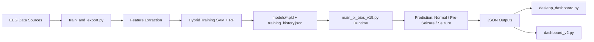
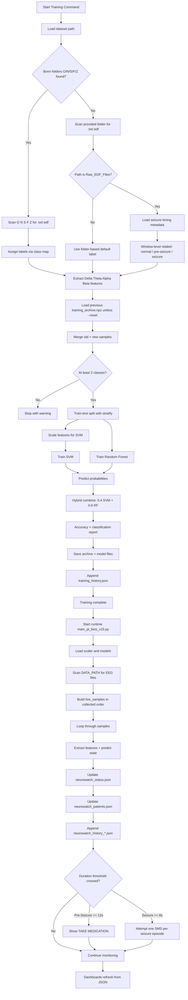

# NeuroWatch Project

> This README is auto-generated by `generate_readme.py`.
> Last generated: 2026-04-07 11:33:40

NeuroWatch is an EEG seizure detection and monitoring project that combines machine learning, a Raspberry Pi runtime, patient-state tracking, JSON feeds for a dashboard, and optional SMS alerts.

## What This Project Does

- Detects EEG states as `Normal`, `Pre-Seizure`, or `Seizure`
- Uses a hybrid `SVM + Random Forest` model
- Monitors one live patient and can simulate demo patients for the dashboard
- Writes JSON outputs for real-time UI updates
- Supports optional Raspberry Pi GPIO, LCD, buzzer, and Twilio SMS alerts
- Includes a terminal-based maintenance BIOS mode (`--bios`) for health checks, exports, and resets

## Main Files

- `dashboard_v2.py`: Streamlit dashboard for multi-patient monitoring, metrics, and history views.
- `desktop_dashboard.py`: Native Tkinter desktop dashboard with patient photo support and a live sample/confidence graph tab.
- `generate_readme.py`: Project utility script.
- `main_pi_bios_v15.py`: Main live monitoring engine for EEG detection, patient state updates, and hardware alerts.
- `neurowatch_metrics.py`: Offline metrics pipeline for the prepared test dataset.
- `patients.py`: Patient registry with live and demo patient definitions.
- `run_prediction.py`: Local prediction and visualization utility for stepping through EEG files.
- `scan_edf_dataset.py`: Dataset scanning helper for EDF-based EEG files.
- `sms_notifier.py`: Twilio-based SMS notification helper with cooldown handling.
- `train_and_export.py`: Training and incremental retraining pipeline that exports the scaler and models.

## Data Layout

- `data/Bonn Univeristy Dataset/`
- `data/Test dataset/`

Datasets
Mendelay Data (https://data.mendeley.com/datasets/5pc2j46cbc/1)
Bonn University Dataset

## Models

- Export path: `models/`
- Main artifacts: `scaler.pkl`, `svm_model.pkl`, `rf_model.pkl`
- Incremental training artifacts: `training_archive.npz`, `training_history.json`

## Workflow

### Overview Workflow



### Full Workflow



## Latest Training Info and Test Results

Source: `models/training_history.json` (most recent run)

### Latest Incremental Training Run

- Timestamp: `2026-04-10T08:04:57`
- Dataset: `data/Test Dataset/Raw_EDF_Files`
- Previous samples: `500`
- New samples added: `208,183`
- Total samples after merge: `208,683`
- Reported hybrid test accuracy: `93.26%`

### Dataset Split Used

- Split strategy: `train_test_split(..., test_size=0.2, stratify=y_combined)`
- Train/Test ratio: `80% / 20%` (stratified by class)
- Latest run counts: `166,946 train` and `41,737 test`

### Previous Baseline Run

- Timestamp: `2026-04-07T12:15:15`
- Dataset: `data/Bonn Univeristy Dataset`
- Samples: `500`
- Reported hybrid test accuracy: `80.00%`

### Latest Classification Report (Test Split)

| Class | Precision | Recall | F1-score | Support |
|---|---:|---:|---:|---:|
| Normal | 0.93 | 1.00 | 0.97 | 38,880 |
| Pre-Seizure | 0.88 | 0.02 | 0.03 | 2,058 |
| Seizure | 0.82 | 0.02 | 0.04 | 799 |
| **Accuracy** |  |  | **0.93** | **41,737** |
| Macro avg | 0.88 | 0.35 | 0.35 | 41,737 |
| Weighted avg | 0.93 | 0.93 | 0.90 | 41,737 |

### Quick Interpretation

- Accuracy improved strongly vs the earlier baseline run (`80.00%` -> `93.26%`).
- Recall for `Pre-Seizure` and `Seizure` is still very low in this split, so seizure-event sensitivity needs improvement even with higher overall accuracy.

## Dependencies

Core packages detected from the Python scripts:

- `joblib`
- `matplotlib`
- `mne`
- `numpy`
- `pandas`
- `plotly`
- `pyedflib`
- `scipy`
- `sklearn`
- `streamlit`

Optional integrations detected:

- `RPLCD`
- `RPi`
- `twilio`

Suggested install command:

```bash
pip install joblib matplotlib mne numpy pandas plotly pyedflib scikit-learn scipy streamlit twilio
```

## Common Commands

Train or refresh the models:

```bash
python train_and_export.py --data "data/Bonn Univeristy Dataset"
python train_and_export.py --data "data/Test Dataset/Raw_EDF_Files"                    
```

Run the monitoring engine:

```bash
python main_pi_bios_v15.py
```

Run maintenance BIOS mode:

```bash
python main_pi_bios_v15.py --bios
```

Run the dashboard:

```bash
streamlit run dashboard_v2.py
```

Run the desktop dashboard (non-Streamlit):

```bash
python desktop_dashboard.py
```

Patient photos for both dashboards:

```text
patient_photos/P001.jpg
patient_photos/P002.jpg
...
```

`P001` maps to patient id `P001`.

Compute offline metrics:

```bash
python neurowatch_metrics.py
```

Regenerate this README manually:

```bash
python generate_readme.py
```

Start automatic README updates in PowerShell:

```powershell
.\watch_readme.ps1
```

## Runtime Outputs

- `neurowatch_status.json`
- `neurowatch_patients.json`
- `neurowatch_metrics.json`
- `neurowatch_history_P001.json`
- `neurowatch_history_P002.json`
- `neurowatch_history_P003.json`
- `neurowatch_history_P004.json`
- `neurowatch_history_P005.json`
- `neurowatch_history_P006.json`
- `neurowatch_history_P007.json`

## Auto-Update Behavior

The README can now be regenerated automatically by `watch_readme.ps1`.
The watcher listens for changes in project files such as Python, PowerShell, JSON, and Markdown files, then reruns `generate_readme.py` after a short debounce delay.

Files currently included in that watch scope:

- `dashboard_v2.py`
- `data/Test dataset/Preprocessing_Scripts/Preprocess.py`
- `data/Test dataset/Preprocessing_Scripts/Seizure_times.py`
- `generate_readme.py`
- `main_pi_bios_v15.py`
- `neurowatch_history_P001.json`
- `neurowatch_history_P002.json`
- `neurowatch_history_P003.json`
- `neurowatch_history_P004.json`
- `neurowatch_history_P005.json`
- `neurowatch_history_P006.json`
- `neurowatch_history_P007.json`
- `neurowatch_metrics.py`
- `patients.py`
- `run_prediction.py`
- `scan_edf_dataset.py`
- `sms_notifier.py`
- `train_and_export.py`
- `watch_readme.ps1`

## Notes

- The auto-generated README is best for keeping structure, scripts, and commands current.
- It cannot infer every design decision or research note automatically, so you can still add manual project documentation elsewhere if you want richer narrative docs.
- `sms_notifier.py` should use environment variables for secrets before sharing or deploying this project.
- Alarm behavior in the live engine:
	- `Pre-Seizure`: periodic single beep pattern
	- `Seizure`: rapid continuous beep pattern
	- prolonged `Pre-Seizure`: LCD row 4 shows `TAKE MEDICATION`
	- prolonged `Seizure`: LCD row 4 shows `CONTACT DR` or `DR NOTIFIED` (based on SMS send result)
